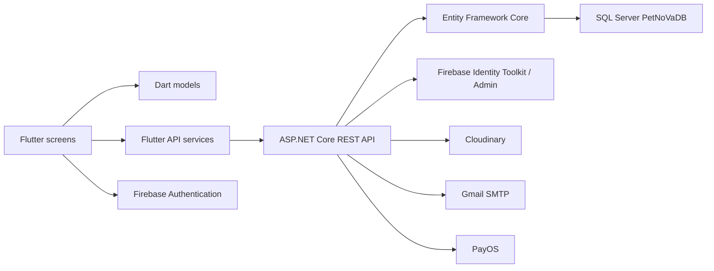

# Sổ tay ôn thi vấn đáp PetNoVa

> Đối chiếu trực tiếp với mã nguồn ngày 08/08/2026. Số dòng trong tài liệu là số dòng của phiên bản hiện tại; nếu sửa code sau ngày này thì số dòng có thể thay đổi.

## 1. Bài giới thiệu ngắn 30–45 giây

PetNoVa là ứng dụng Flutter hỗ trợ quản lý và chăm sóc thú cưng. Hệ thống có bốn vai trò: khách hàng, nhân viên chăm sóc, bác sĩ thú y và quản trị viên. Flutter phụ trách giao diện; Firebase Authentication xác thực tài khoản; backend ASP.NET Core cung cấp REST API; Entity Framework Core kết nối SQL Server `PetNoVaDB`; Cloudinary lưu ảnh; Gmail SMTP gửi OTP; PayOS xử lý thanh toán chuyển khoản. Sau khi Firebase xác thực thành công, ứng dụng lấy tài khoản trong SQL Server để kiểm tra trạng thái và điều hướng theo vai trò.

Các điểm vào quan trọng:

- Khởi động Flutter: `lib/main.dart:8-30`.
- Cấu hình địa chỉ API: `lib/config/api_config.dart:3-22`.
- Khởi động backend và đăng ký dịch vụ: `backend/PetNoVaApi/Program.cs:7-98`.
- Kết nối Entity Framework với các bảng: `backend/PetNoVaApi/Data/PetNoVaDbContext.cs:6-50`.

## 2. Kiến trúc hệ thống



Luồng dữ liệu tiêu chuẩn:

1. `Screen` nhận thao tác người dùng.
2. Screen tạo/đọc một `Model`.
3. Screen gọi lớp trong `lib/services`.
4. Service gửi HTTP đến controller ASP.NET Core.
5. Controller dùng `PetNoVaDbContext` đọc hoặc ghi SQL Server.
6. Backend trả JSON; service chuyển JSON thành model; screen cập nhật giao diện.

Ví dụ thêm thú cưng:

- Form và kiểm tra dữ liệu: `lib/screens/add_pet_screen.dart:32-125`.
- Trang danh sách nhận kết quả và gọi API: `lib/screens/customer_home_screen.dart:548-600`.
- Service gửi `POST /api/Pets`: `lib/services/pet_api_service.dart:64-92`.
- Backend tạo bản ghi: `backend/PetNoVaApi/Controllers/PetsController.cs:37`.
- Nếu có ảnh, app tải ảnh sau khi đã có `petId`: `lib/screens/customer_home_screen.dart:563-584`.

## 3. Công nghệ và lý do sử dụng

| Công nghệ | Công dụng | Nơi thể hiện trong code |
| --- | --- | --- |
| Flutter/Dart | Một codebase cho giao diện mobile | `lib/main.dart:8-34` |
| Firebase Core/Auth | Đăng ký, đăng nhập, duy trì phiên | `pubspec.yaml:37-38`, `lib/screens/login_screen.dart:195-212` |
| ASP.NET Core 10 | REST API và business logic | `backend/PetNoVaApi/PetNoVaApi.csproj:4`, `Program.cs:14-16` |
| Entity Framework Core SQL Server | Ánh xạ object C# sang bảng SQL | `PetNoVaApi.csproj:13-17`, `PetNoVaDbContext.cs:13-23` |
| SQL Server `PetNoVaDB` | Lưu dữ liệu nghiệp vụ lâu dài | `backend/PetNoVaApi/appsettings.json:3` |
| Cloudinary | Lưu avatar người dùng và ảnh thú cưng | `Program.cs:40-44`, `CloudinaryMediaService.cs:44-132` |
| Gmail SMTP | Gửi OTP đặt lại mật khẩu | `Program.cs:46-48`, `SmtpEmailSender.cs:76-138` |
| Firebase Admin | Đổi mật khẩu Firebase sau khi OTP hợp lệ | `FirebasePasswordManager.cs:110-169` |
| PayOS | Tạo link/VietQR và xác nhận chuyển khoản | `PaymentsController.cs:119-266` |
| `flutter_secure_storage` | Lưu email/mật khẩu đã nhớ trong Android KeyStore | `pubspec.yaml:39`, `credential_store.dart:20-96` |
| `shared_preferences` | Lưu danh sách thông báo bị ẩn trên từng máy | `pubspec.yaml:43`, `hidden_notification_service.dart:3-20` |
| `image_picker` | Chọn ảnh từ thư viện | `pubspec.yaml:42`, `add_pet_screen.dart:32-50` |
| `url_launcher` | Mở trang thanh toán PayOS bên ngoài app | `pubspec.yaml:44`, `customer_payment_page.dart:77-93` |

## 4. Cấu trúc thư mục Flutter

### `lib/models`

Model là khuôn dữ liệu trong Flutter, không phải nơi lưu dữ liệu. Model nhận JSON từ API và cung cấp object có kiểu rõ ràng cho giao diện.

| Model | Ý nghĩa | Dòng chính |
| --- | --- | --- |
| `UserAccountModel` | Tài khoản, Firebase UID, role, status, avatar | `lib/models/user_account_model.dart:1-41` |
| `StaffModel` | Nhân viên/bác sĩ, vai trò, vi phạm, trạng thái | `lib/models/staff_model.dart:1-32` |
| `PetModel` | Thú cưng và URL/public ID ảnh | `lib/models/pet_model.dart:1-81` |
| `PetFormResult` | Kết quả form thú cưng kèm bytes ảnh tạm | `lib/models/pet_form_result.dart:3-12` |
| `BookingModel` | Lịch hẹn | `lib/models/booking_model.dart:1-54` |
| `BookingDetailModel` | Gói dịch vụ thuộc lịch hẹn | `lib/models/booking_detail_model.dart:1-31` |
| `ServicePackageModel` | Gói dịch vụ | `lib/models/service_package_model.dart:1-39` |
| `PaymentModel` | Phương thức, tiền, trạng thái thanh toán | `lib/models/payment_model.dart:1-35` |
| `MedicalRecordModel` | Bệnh án | `lib/models/medical_record_model.dart:1-39` |
| `VaccinationModel` | Lịch tiêm | `lib/models/vaccination_model.dart:1-39` |
| `NotificationModel` | Thông báo của người dùng | `lib/models/notification_model.dart:1-67` |
| `HealthLogModel` | Nhật ký sức khỏe đang lưu cục bộ | `lib/models/health_log_model.dart:1-16` |
| `MediaUploadResult` | Kết quả Cloudinary `{url, publicId}` | `lib/models/media_upload_result.dart:1-19` |

### `lib/services`

Service chịu trách nhiệm giao tiếp HTTP hoặc bộ nhớ thiết bị. Screen không nên tự xây toàn bộ logic mạng.

- Chuẩn hóa timeout và lỗi kết nối: `lib/services/api_client.dart:17-107`.
- Tài khoản: `user_account_api_service.dart:18-138`.
- Thú cưng: `pet_api_service.dart:7-92`.
- Lịch hẹn: `booking_api_service.dart:7-106`.
- Chi tiết lịch: `booking_detail_api_service.dart:7-58`.
- Gói dịch vụ: `service_package_api_service.dart:7-97`.
- Thanh toán/PayOS: `payment_api_service.dart:7-115`.
- Bệnh án: `medical_record_api_service.dart:7-44`.
- Lịch tiêm: `vaccination_api_service.dart:7-44`.
- Thông báo: `notification_api_service.dart:7-56`.
- Tải ảnh: `media_api_service.dart:21-232`.
- Quên mật khẩu: `password_reset_api_service.dart:51-198`.
- Nhớ mật khẩu: `credential_store.dart:12-96`.
- Ẩn thông báo cục bộ: `hidden_notification_service.dart:3-20`.

### `lib/screens`

Screen là giao diện và điều phối thao tác của người dùng. Business logic quan trọng vẫn được kiểm tra lại ở backend.

## 5. Khởi động, đăng nhập và phân quyền

### Khởi động app

1. `WidgetsFlutterBinding.ensureInitialized()` tại `lib/main.dart:8-10`.
2. Khởi tạo Firebase tại `lib/main.dart:11`.
3. Chạy `PetNoVaApp` tại `lib/main.dart:13`.
4. MaterialApp nhận theme và mở `SplashScreen` tại `lib/main.dart:21-30`.

### Splash tự kiểm tra phiên

- Splash gọi kiểm tra sau khi dựng frame: `lib/screens/splash_screen.dart:28-47`.
- Tìm tài khoản SQL theo Firebase UID, fallback theo email: `splash_screen.dart:50-61`.
- Ánh xạ bốn role sang bốn màn hình: `splash_screen.dart:64-80`.
- Nếu chưa đăng nhập thì về Login: `splash_screen.dart:92-102`.
- Nếu tài khoản SQL không `ACTIVE`, đăng xuất: `splash_screen.dart:104-125`.
- Nếu hợp lệ, điều hướng theo role: `splash_screen.dart:127-132`.

### Đăng ký khách hàng

- Kiểm tra đủ trường và mật khẩu từ 6 ký tự: `lib/screens/register_screen.dart:26-43`.
- Tạo Firebase user: `register_screen.dart:48-55`.
- Cập nhật display name: `register_screen.dart:57`.
- Tạo `UserAccountModel` mặc định `CUSTOMER/ACTIVE`: `register_screen.dart:59-69`.
- Tạo tài khoản SQL qua API: `register_screen.dart:71`.
- Backend bắt buộc Firebase UID/email khớp token, ép role `CUSTOMER`, chuẩn hóa số điện thoại và sinh `Uxxx`: `UserAccountsController.cs:179-273`.

### Đăng nhập

- Kiểm tra email/mật khẩu: `lib/screens/login_screen.dart:195-202`.
- Firebase xác thực email/password: `login_screen.dart:204-212`.
- Tải tài khoản SQL và kiểm tra `ACTIVE`: `login_screen.dart:130-156`.
- Điều hướng `CUSTOMER`, `STAFF`, `VET`, `ADMIN`: `login_screen.dart:158-176`.
- Chuyển lỗi Firebase thành câu tiếng Việt: `login_screen.dart:230-255`.

### Nhớ mật khẩu

- Nạp dữ liệu đã nhớ: `login_screen.dart:52-69`.
- Lưu hoặc xóa sau khi đăng nhập: `login_screen.dart:71-101`.
- Dữ liệu được gói thành JSON và lưu bằng `FlutterSecureStorage`: `credential_store.dart:20-80`.
- Khi bỏ chọn hoặc đổi mật khẩu, dữ liệu cũ được xóa: `credential_store.dart:82-96`, `login_screen.dart:103-127`.

Điểm trả lời quan trọng: đây không phải lưu vào `SharedPreferences`; mật khẩu được lưu bằng secure storage/Android KeyStore. Tuy nhiên mọi tính năng “nhớ mật khẩu” vẫn có rủi ro nếu thiết bị bị chiếm quyền, nên app thực tế thường ưu tiên token phiên hoặc sinh trắc học.

## 6. Quên mật khẩu bằng số điện thoại và OTP Gmail

### Luồng Flutter

1. Bốn trạng thái `phone -> otp -> password -> success`: `lib/screens/forgot_password_screen.dart:10-38`.
2. Nhập số điện thoại và gọi request OTP: `forgot_password_screen.dart:46-71`.
3. Kiểm tra OTP đúng 6 chữ số và xác minh: `forgot_password_screen.dart:74-94`.
4. Kiểm tra hai mật khẩu, gửi yêu cầu hoàn tất: `forgot_password_screen.dart:96-135`.
5. Đồng hồ chờ gửi lại OTP: `forgot_password_screen.dart:155-169`.
6. Ba endpoint Flutter sử dụng: `password_reset_api_service.dart:90-172`.

### Luồng backend

- Controller có rate limit và ba endpoint request/verify/complete: `PasswordResetController.cs:9-150`.
- Chỉ cho HTTPS hoặc HTTP loopback khi phát triển: `PasswordResetController.cs:152-169`.
- Chuẩn hóa số Việt Nam và chỉ tìm `CUSTOMER + ACTIVE`: `PasswordResetService.cs:111-152`.
- Kiểm tra Firebase UID/email còn khớp: `PasswordResetService.cs:154-178`.
- Sinh OTP 6 số bằng bộ sinh số mật mã: `PasswordResetService.cs:219-233`.
- Chỉ lưu HMAC-SHA256 của OTP, không lưu OTP thô: `PasswordResetService.cs:228`, `509-515`.
- Gửi OTP đến email liên kết: `PasswordResetService.cs:238-271`, `SmtpEmailSender.cs:76-138`.
- Giới hạn số lần thử và so sánh hash constant-time: `PasswordResetService.cs:305-365`.
- Reset token dùng một lần; sau đó Firebase Admin đổi mật khẩu: `PasswordResetService.cs:368-468`.
- Firebase Admin thu hồi refresh token cũ theo best effort: `FirebasePasswordManager.cs:128-149`.
- Chống dò xem số điện thoại có tồn tại bằng kết quả “opaque” và thời gian phản hồi gần giống nhau: `PasswordResetService.cs:92-108`, `525-590`.
- Rate limit 20 yêu cầu/5 phút theo IP: `Program.cs:50-65`.

Các bảng/cột OTP được tự kiểm tra khi backend chạy: `PasswordResetSchemaInitializer.cs:10-170`.

## 7. Chức năng khách hàng

### Điều hướng chính

Khách hàng có bốn tab: Trang chủ, Thú cưng, Đặt lịch, Tài khoản tại `lib/screens/customer_home_screen.dart:37-65`; thanh điều hướng ở `customer_home_screen.dart:81-99`.

Trang tổng quan lấy tên từ Firebase và cung cấp lối tắt: `customer_home_screen.dart:103-184`. Thẻ “Sắp diễn ra” hiện chỉ là nút dẫn tới tab lịch hẹn, không tự hiển thị một booking cụ thể: `customer_home_screen.dart:431-489`.

### Quản lý thú cưng

- Tải đúng thú cưng theo user SQL hiện tại: `customer_home_screen.dart:511-546`.
- Hiển thị avatar Cloudinary hoặc placeholder: `customer_home_screen.dart:639-647`.
- Mở trang chi tiết và tải lại sau khi quay về: `customer_home_screen.dart:627-636`.
- Mở lịch tiêm/bệnh án của từng pet: `customer_home_screen.dart:698-733`.
- Chọn ảnh từ thư viện, resize tối đa 1024 và chất lượng 85: `add_pet_screen.dart:32-50`.
- Kiểm tra trường và cân nặng: `add_pet_screen.dart:65-88`.
- Tạo pet trước, sau đó upload ảnh bằng `petId`: `customer_home_screen.dart:548-592`.
- Chỉnh sửa thông tin pet: `edit_pet_screen.dart:78-121`.
- Cập nhật SQL rồi upload ảnh mới: `pet_detail_screen.dart:316-365`.

### Ảnh người dùng và thú cưng bằng Cloudinary

Luồng ảnh từ app:

- App lấy Firebase ID token, tạo multipart request: `media_api_service.dart:78-107`.
- Avatar gọi `POST /api/Media/avatar`: `media_api_service.dart:24-34`.
- Ảnh pet gọi `POST /api/Media/pets/{petId}`: `media_api_service.dart:36-55`.
- Edit profile chọn avatar: `edit_profile_screen.dart:91-121`.
- Edit profile cập nhật SQL/display name và upload avatar: `edit_profile_screen.dart:124-179`.

Luồng backend:

- Xác minh Firebase Bearer token và quyền sở hữu pet: `MediaController.cs:97-181`, `333-395`.
- Giới hạn ảnh thật tối đa 5 MB, chỉ JPEG/PNG/WebP và kiểm tra magic bytes: `ImageUploadValidator.cs:3-67`, `87-113`.
- Upload lên Cloudinary và nhận `secure_url/public_id`: `CloudinaryMediaService.cs:67-132`.
- Lưu URL/public ID vào SQL; nếu thay ảnh thì xóa ảnh Cloudinary cũ: `MediaController.cs:184-246`.
- Thư mục Cloudinary có dạng `petnova/users/{firebaseUid}/avatar` hoặc `.../pets/{petId}`: `MediaController.cs:83-93`, `165-180`, `397-414`.
- Backend tự thêm bốn cột media nếu chưa có: `MediaSchemaInitializer.cs:7-48`.

API secret Cloudinary chỉ ở backend User Secrets; app Flutter không chứa API secret.

### Đặt lịch

- Tải song song pets, bookings, services, details và payments: `customer_home_screen.dart:801-872`.
- Chỉ đưa gói dịch vụ `ACTIVE` vào form: `customer_home_screen.dart:849-851`.
- Chọn ngày từ hôm nay đến một năm sau: `customer_home_screen.dart:883-897`.
- Chọn loại chăm sóc `CT001/CT002`: `customer_home_screen.dart:773-777`.
- Tạo lần lượt Booking -> BookingDetail -> Payment: `customer_home_screen.dart:978-1049`.
- Booking mặc định `PENDING`; Payment mặc định `PENDING`: `customer_home_screen.dart:1013-1046`.
- Backend sinh mã booking, tạo thông báo đặt lịch: `BookingsController.cs:39-60`.

### Hủy và theo dõi lịch

- Customer chỉ hủy khi `PENDING` hoặc `CONFIRMED`: `customer_home_screen.dart:1082-1086`.
- Có dialog xác nhận, gọi API và tải lại: `customer_home_screen.dart:1088-1143`.
- Lịch `CANCELLED` hiển thị tối đa 30 ngày trong app: `customer_home_screen.dart:768-769`, `912-923`.
- Backend kiểm tra lại trạng thái và tạo thông báo hủy: `BookingsController.cs:63-92`.
- Card hiển thị pet, dịch vụ, ngày, tiền, trạng thái và mở thanh toán: `customer_home_screen.dart:1417-1506`.

### Thanh toán

- CASH: khách xem hướng dẫn trả tại quầy; nhân viên xác nhận thủ công.
- BANK_TRANSFER: app yêu cầu backend tạo link PayOS và mở bằng trình duyệt: `customer_payment_page.dart:77-93`.
- App kiểm tra lại trạng thái PayOS: `customer_payment_page.dart:95-117`.
- Backend tạo link hết hạn sau 15 phút: `PaymentsController.cs:119-181`.
- Backend đồng bộ trạng thái PayOS: `PaymentsController.cs:196-236`.
- Webhook được SDK PayOS xác minh và đối chiếu số tiền: `PaymentsController.cs:238-266`.
- Chỉ CASH được nhân viên xác nhận thủ công: `PaymentsController.cs:280-307`.
- Khi PAID, backend tạo thông báo thanh toán thành công: `PaymentsController.cs:344-366`.

### Thông báo

- Badge chưa đọc nằm ở profile: `profile_page.dart:67-112`.
- Mở màn thông báo theo đúng user SQL: `profile_page.dart:114-149`.
- Tải API và loại các thông báo đã ẩn cục bộ: `notification_screen.dart:31-63`.
- Đánh dấu một hoặc tất cả đã đọc: `notification_screen.dart:138-180`.
- Chọn nhiều thông báo đã đọc và ẩn khỏi thiết bị: `notification_screen.dart:65-136`.
- Endpoint backend: `NotificationsController.cs:19-94`.

Lưu ý: “xóa thông báo” chỉ lưu ID bị ẩn bằng SharedPreferences trên máy; bản ghi SQL không bị xóa.

### Xem bệnh án và lịch tiêm

- Customer xem bệnh án theo pet: `customer_medical_record_page.dart:36-65`.
- Customer xem lịch tiêm theo pet: `customer_vaccination_page.dart:36-65`.
- Đây là màn chỉ đọc; bác sĩ dùng màn riêng để thêm dữ liệu.

### Hồ sơ khách hàng

- Tải hồ sơ SQL và badge thông báo: `profile_page.dart:47-112`.
- Cập nhật tên Firebase display name và họ tên/số điện thoại SQL: `edit_profile_screen.dart:124-150`.
- Upload avatar nếu có chọn ảnh mới: `edit_profile_screen.dart:152-170`.
- Đăng xuất Firebase và xóa navigation stack: `profile_page.dart:35-45`.

## 8. Chức năng nhân viên chăm sóc

- Tải bookings, booking details, services và payments: `lib/screens/staff_home_screen.dart:45-77`.
- Xác nhận thanh toán tiền mặt: `staff_home_screen.dart:132-149`.
- Kiểm tra chuyển khoản PayOS: `staff_home_screen.dart:151-177`.
- Luồng trạng thái tuần tự: `PENDING -> CONFIRMED -> IN_PROGRESS -> COMPLETED` tại `staff_home_screen.dart:179-203`.
- Không cho hoàn thành nếu chưa PAID ở Flutter: `staff_home_screen.dart:217-242`.
- Backend kiểm tra lại luồng trạng thái và điều kiện thanh toán: `BookingsController.cs:119-166`.
- Mỗi lần chuyển trạng thái backend tạo thông báo cho customer: `BookingsController.cs:168-201`.

Điểm chưa hoàn thiện: tên thú cưng ở màn staff đang có map mẫu chỉ cho `P001/P002` tại `staff_home_screen.dart:32-37`; pet khác có thể hiện mã thay vì tên.

## 9. Chức năng bác sĩ thú y

- Tải toàn bộ pets: `lib/screens/vet_home_screen.dart:32-51`.
- Hiển thị ảnh, thông tin và sức khỏe: `vet_home_screen.dart:132-188`.
- Mở bệnh án: `vet_home_screen.dart:84-93`, `196-202`.
- Mở lịch tiêm có quyền thêm: `vet_home_screen.dart:203-217`.
- Tải bệnh án theo pet: `medical_record_screen.dart:33-54`.
- Thêm bệnh án: `medical_record_screen.dart:56-187`.
- Tải lịch tiêm theo pet: `vaccination_screen.dart:32-53`.
- Thêm lịch tiêm và tính cảnh báo quá hạn: `vaccination_screen.dart:55-218`, `224-239`.

Điểm chưa hoàn thiện: `currentStaffId` đang cố định là `ST001` trong bệnh án và lịch tiêm: `medical_record_screen.dart:23-25`, `vaccination_screen.dart:24`. Chưa lấy staffId của bác sĩ đang đăng nhập.

## 10. Chức năng quản trị viên

### Điều hướng admin

Bốn tab admin được nối tại `lib/screens/admin_home_screen.dart:27-42`:

1. Tổng quan.
2. Người dùng.
3. Gói dịch vụ.
4. Nhân viên.

### Dashboard

- Tải bookings, pets, payments: `admin_home_screen.dart:125-135`.
- Tính tổng lịch, lịch pending, tổng pets, số payment paid và doanh thu: `admin_home_screen.dart:137-153`.

### Người dùng

- Admin tải danh sách bằng Bearer token: `admin_user_api_service.dart:8-31`.
- Giao diện tải và hiển thị role/status/avatar: `admin_user_management_page.dart:26-49`, `111-189`.

Hiện màn người dùng mới chỉ xem danh sách; chưa có nút khóa/mở khóa hoặc đổi role trên màn này, dù backend có endpoint tại `UserAccountsController.cs:276-384`.

### Gói dịch vụ

- Tải danh sách: `admin_service_management_page.dart:55-79`.
- Dialog thêm/sửa và validation: `admin_service_management_page.dart:80-294`.
- Xóa gói: `admin_service_management_page.dart:317-361`.
- Bật/tắt trạng thái: `admin_service_management_page.dart:363-378`.
- Backend CRUD/toggle: `ServicePackagesController.cs:19-151`.

### Nhân viên và bác sĩ

- Tải/filter staff: `admin_staff_management_page.dart:18-74`.
- Dialog tạo tài khoản: `admin_staff_management_page.dart:76-290`.
- Dùng Firebase secondary app để tạo staff mà không đăng xuất admin hiện tại: `admin_staff_management_page.dart:291-339`.
- Sửa staff: `admin_staff_management_page.dart:342-512`.
- Xóa, bật/tắt, ghi vi phạm, kích hoạt lại: `admin_staff_management_page.dart:514-604`.
- Backend yêu cầu active admin cho mọi endpoint staff: `StaffsController.cs:27-35`, `411-458`.
- Đủ ba vi phạm thì staff bị `SUSPENDED`: `StaffsController.cs:308-339`.
- Khi xóa staff, bản ghi STAFF bị xóa và USER_ACCOUNT trở lại CUSTOMER; Firebase user không bị xóa: `StaffsController.cs:222-279`.

## 11. Backend và cơ sở dữ liệu

### Các bảng EF đang ánh xạ

`PetNoVaDbContext` khai báo tại `backend/PetNoVaApi/Data/PetNoVaDbContext.cs:13-23`:

- `USER_ACCOUNT` — model `UserAccount.cs:6-35`.
- `STAFF` — model `Staff.cs:6-24`.
- `PET` — model `Pet.cs:6-32`.
- `BOOKING` — model `Booking.cs:6-30`.
- `BOOKING_DETAIL` — model `BookingDetail.cs:6-18`.
- `SERVICE_PACKAGE` — model `ServicePackage.cs:6-22`.
- `PAYMENT` — model `Payment.cs:6-20`.
- `MEDICAL_RECORD` — model `MedicalRecord.cs:6-22`.
- `VACCINATION` — model `Vaccination.cs:6-22`.
- `NOTIFICATION` — model `Notification.cs:6-26`.
- `PASSWORD_RESET_CHALLENGE` — model `PasswordResetChallenge.cs:7-47`.

EF cấu hình precision cho tiền/cân nặng và quan hệ Staff -> UserAccount tại `PetNoVaDbContext.cs:29-50`.

### Bản đồ endpoint chính

| Endpoint | Chức năng | Controller/dòng |
| --- | --- | --- |
| `GET/POST /api/UserAccounts` | Danh sách admin / tạo customer | `UserAccountsController.cs:25`, `179` |
| `GET /api/UserAccounts/firebase/{uid}` | Lấy user theo Firebase UID | `UserAccountsController.cs:85` |
| `GET /api/UserAccounts/email/{email}` | Lấy user theo email | `UserAccountsController.cs:127` |
| `PUT /api/UserAccounts/update-profile-by-email/{email}` | Sửa hồ sơ | `UserAccountsController.cs:385` |
| `GET/POST /api/Pets` | Danh sách / thêm pet | `PetsController.cs:19`, `37` |
| `PUT /api/Pets/{id}` | Sửa pet | `PetsController.cs:49` |
| `GET /api/Pets/user/{userId}` | Pets theo chủ | `PetsController.cs:77` |
| `POST /api/Media/avatar` | Upload avatar | `MediaController.cs:34` |
| `POST /api/Media/pets/{petId}` | Upload ảnh pet | `MediaController.cs:97` |
| `GET/POST /api/Bookings` | Danh sách / tạo booking | `BookingsController.cs:20`, `39` |
| `PUT /api/Bookings/{id}/cancel` | Hủy booking | `BookingsController.cs:63` |
| `PUT /api/Bookings/{id}/status` | Chuyển trạng thái | `BookingsController.cs:119` |
| `GET /api/Bookings/user/{userId}` | Booking theo user | `BookingsController.cs:203` |
| `GET/POST /api/BookingDetails` | Danh sách / tạo chi tiết | `BookingDetailsController.cs:19`, `33` |
| `GET/POST/PUT/DELETE /api/ServicePackages` | CRUD dịch vụ | `ServicePackagesController.cs:19-129` |
| `PUT /api/ServicePackages/{id}/toggle-status` | Bật/tắt dịch vụ | `ServicePackagesController.cs:130` |
| `GET/POST /api/Payments` | Danh sách / tạo payment | `PaymentsController.cs:59`, `86` |
| `POST /api/Payments/{id}/payos-link` | Tạo link PayOS | `PaymentsController.cs:119` |
| `POST /api/Payments/{id}/payos-sync` | Đồng bộ PayOS | `PaymentsController.cs:196` |
| `POST /api/Payments/payos-webhook` | Webhook PayOS | `PaymentsController.cs:238` |
| `PUT /api/Payments/{id}/confirm` | Staff xác nhận CASH | `PaymentsController.cs:280` |
| `GET/POST /api/MedicalRecords` | Đọc/thêm bệnh án | `MedicalRecordsController.cs:19-52` |
| `GET/POST /api/Vaccinations` | Đọc/thêm lịch tiêm | `VaccinationsController.cs:19-51` |
| `GET/POST/PUT/DELETE /api/Staffs` | Quản lý staff/vet | `StaffsController.cs:27-281` |
| `PUT /api/Staffs/{id}/add-violation` | Ghi vi phạm | `StaffsController.cs:308` |
| `GET /api/Notifications/user/{userId}` | Thông báo theo user | `NotificationsController.cs:19` |
| `PUT /api/Notifications/{id}/read` | Đánh dấu đã đọc | `NotificationsController.cs:67` |
| `PUT /api/Notifications/user/{id}/read-all` | Đọc tất cả | `NotificationsController.cs:84` |
| `POST /api/auth/password-reset/request` | Xin OTP | `PasswordResetController.cs:25` |
| `POST /api/auth/password-reset/verify` | Xác minh OTP | `PasswordResetController.cs:76` |
| `POST /api/auth/password-reset/complete` | Đổi mật khẩu | `PasswordResetController.cs:109` |
| `GET /health` | Kiểm tra API và SQL | `Program.cs:90-96` |

## 12. Giao diện Playful Orbit

- Token màu/radius và widget Orbit: `lib/theme/orbit_design.dart:8-232`.
- Theme toàn ứng dụng: `lib/theme/app_theme.dart:119-513`.
- `AppColors` cũ được ánh xạ sang Orbit để đổi giao diện mà không phá business logic: `app_theme.dart:19-82`.
- Cả getter `light` và `dark` đang cùng trả về Playful Orbit: `app_theme.dart:510-513`.
- Ảnh mạng có placeholder an toàn: `lib/widgets/orbit_media_image.dart:7-101`.
- App icon: `pubspec.yaml:103-106`.

## 13. Cách chạy khi demo/đi thi

### Chỉ chuẩn bị backend và mở app đã cài

```powershell
.\run_petnova_dev.cmd -NoFlutter
```

Script sẽ:

1. Kiểm tra `/health`: `run_petnova_dev.ps1:103-156`.
2. Tự chạy backend nếu chưa chạy: `run_petnova_dev.ps1:119-153`.
3. Tìm đúng `adb.exe` từ Android SDK: `run_petnova_dev.ps1:159-163`.
4. Kiểm tra điện thoại USB: `run_petnova_dev.ps1:166-190`.
5. Tạo `adb reverse tcp:5200 tcp:5200`: `run_petnova_dev.ps1:192-202`.
6. Giữ backend chạy nền: `run_petnova_dev.ps1:262-264`.

### Chạy lại cả Flutter

```powershell
.\run_petnova_dev.cmd
```

Flutter được chạy với `API_BASE_URL=http://127.0.0.1:5200` tại `run_petnova_dev.ps1:230-233`.

### Buộc khởi động lại backend

```powershell
.\run_petnova_dev.cmd -RestartBackend -NoFlutter
```

### Vì sao đổi Wi-Fi vẫn chạy khi cắm USB?

App Android debug gọi `127.0.0.1:5200` tại `api_config.dart:17-19`. `adb reverse` chuyển cổng đó từ điện thoại sang cổng 5200 của máy tính, nên không phụ thuộc địa chỉ IP Wi-Fi. Bản release thật phải dùng backend HTTPS được triển khai trên Internet, không thể dùng loopback của máy phát triển.

### SSMS có cần mở không?

Không cần mở cửa sổ SSMS. Cần dịch vụ SQL Server đang chạy và database `PetNoVaDB` kết nối được. SSMS chỉ là công cụ quản trị/xem dữ liệu.

## 14. Phần đã hoàn thiện và phần cần nói đúng khi thi

### Có luồng thật từ giao diện đến database/dịch vụ

- Firebase đăng ký/đăng nhập và phân quyền SQL.
- Ghi nhớ mật khẩu bằng secure storage.
- Quên mật khẩu bằng phone -> OTP Gmail -> Firebase Admin.
- CRUD cơ bản thú cưng và ảnh Cloudinary.
- Avatar người dùng Cloudinary.
- Đặt lịch, chi tiết lịch, payment.
- Hủy lịch và luồng trạng thái staff.
- CASH và PayOS.
- Thông báo SQL, đánh dấu đọc, badge, ẩn cục bộ.
- Bệnh án và lịch tiêm.
- Admin dashboard, CRUD dịch vụ, CRUD/quản lý staff/vet.

### Đang mô phỏng, hard-code hoặc chưa hoàn thiện

1. Nhật ký sức khỏe chỉ nằm trong `List` của screen và mất khi rời màn: `health_log_screen.dart:23-67`.
2. Biểu đồ cân nặng pet là số mô phỏng từ cân nặng hiện tại: `pet_detail_screen.dart:34-51`.
3. Ngày sinh hiển thị, màu lông, dị ứng, triệt sản, nhóm máu có phần hard-code: `pet_detail_screen.dart:148-212`.
4. Bác sĩ thêm bệnh án/lịch tiêm bằng `ST001` cố định: `medical_record_screen.dart:23-25`, `vaccination_screen.dart:24`.
5. Staff có map tên pet mẫu `P001/P002`: `staff_home_screen.dart:32-37`.
6. Admin User hiện chỉ xem; API đổi role/status có nhưng UI chưa gọi.
7. `PaymentHistoryScreen` là màn UI riêng và chưa nằm trong navigation chính.
8. `HomeScreen` là màn placeholder cũ, không thuộc luồng role hiện tại.
9. Có trường `fcmToken` nhưng chưa có dependency Firebase Messaging; thông báo hiện được tải từ API, chưa phải push notification.
10. Release Android hiện vẫn ký bằng debug key: `android/app/build.gradle.kts:33-37`; chưa phù hợp để phát hành Store.

### Hạn chế kỹ thuật cần thừa nhận nếu giảng viên hỏi sâu

- Nhiều controller nghiệp vụ như Pets, Bookings, Payments, MedicalRecords, Vaccinations chưa bắt buộc Firebase token/role; bảo vệ chặt hiện tập trung ở UserAccounts, Staffs và Media. Đây là việc ưu tiên trước production.
- Tạo booking -> detail -> payment là ba request riêng (`customer_home_screen.dart:1027-1049`), chưa có transaction API duy nhất; lỗi giữa chừng có thể để lại dữ liệu thiếu.
- Nhiều controller sinh ID dựa trên `Count + 1`, ví dụ booking `BookingsController.cs:42-46` và payment `PaymentsController.cs:101-105`; xóa dữ liệu hoặc request đồng thời có thể gây trùng ID.
- CORS hiện `AllowAnyOrigin/AnyHeader/AnyMethod`: `Program.cs:18-26`; production nên giới hạn domain.
- HTTP chỉ được dùng trong Android debug qua loopback; manifest main chặn cleartext, debug mới cho phép: `android/app/src/main/AndroidManifest.xml:10`, `android/app/src/debug/AndroidManifest.xml:4-5`.

## 15. Kiểm thử hiện có

Hiện có 17 test case tự động trong thư mục `test/`:

- API connection message: `test/api_client_test.dart:5`.
- Dialog admin trên màn hình hẹp: `test/admin_dialog_responsiveness_test.dart:18-29`.
- Model/upload ảnh/placeholder: `test/media_models_test.dart:8-43`.
- Dashboard customer: `test/orbit_customer_dashboard_test.dart:8`.
- 7 test quên mật khẩu và nhớ mật khẩu: `test/password_reset_flow_test.dart:124-372`.
- Khởi tạo app: `test/widget_test.dart:6`.
- Theme Playful Orbit: `test/playful_orbit_theme_test.dart:7-31`.

Kết quả xác minh ngày 08/08/2026: Flutter **17/17 test passed**, `dart analyze` không có issue và backend build thành công với **0 warning, 0 error**.

Lệnh kiểm tra:

```powershell
flutter analyze
flutter test
dotnet build backend\PetNoVaApi\PetNoVaApi.csproj --no-restore
```

## 16. Câu hỏi vấn đáp dễ gặp và câu trả lời gợi ý

### 1. Tại sao dùng cả Firebase và SQL Server?

Firebase Auth chuyên xác thực và quản lý mật khẩu. SQL Server lưu hồ sơ nghiệp vụ như role, trạng thái, pet, booking, payment. Sau đăng nhập Firebase, app lấy user SQL bằng UID để phân quyền.

### 2. Model dùng làm gì?

Model là khuôn dữ liệu có kiểu trong Flutter. Nó chuyển JSON API thành object Dart và ngược lại; không phải database và không tự lưu dữ liệu.

### 3. Service khác Screen thế nào?

Screen hiển thị UI và nhận thao tác. Service giao tiếp API/bộ nhớ. Tách như vậy giảm lặp code và dễ test.

### 4. Backend kết nối SQL ở đâu?

Connection string nằm trong cấu hình backend; EF được đăng ký tại `Program.cs:28-32`; các DbSet ở `PetNoVaDbContext.cs:13-23`.

### 5. Phân quyền nằm ở đâu?

Flutter điều hướng theo role ở `login_screen.dart:158-176` và `splash_screen.dart:64-80`. Backend kiểm tra token/quyền ở các endpoint nhạy cảm như UserAccounts, Staffs, Media. Cần bổ sung authorization cho các controller nghiệp vụ còn lại trước production.

### 6. API secret Cloudinary có nằm trong app không?

Không. Flutter gửi ảnh và Firebase token cho backend. Backend giữ Cloudinary key/secret trong User Secrets rồi upload hộ app.

### 7. Vì sao phải lưu `publicId` Cloudinary ngoài URL?

URL để hiển thị ảnh; `publicId` dùng quản lý hoặc xóa ảnh cũ khi thay ảnh.

### 8. OTP có lưu thẳng trong SQL không?

Không. Backend sinh OTP rồi chỉ lưu HMAC-SHA256 của OTP cùng challenge ID. Khi xác minh, hash được so sánh constant-time.

### 9. Vì sao reset mật khẩu cần backend?

Client không được giữ Firebase Admin credentials. Backend xác minh số điện thoại, OTP, reset token rồi dùng Firebase Admin đổi mật khẩu an toàn.

### 10. ADB reverse dùng làm gì?

Nó chuyển `127.0.0.1:5200` trên điện thoại USB về cổng 5200 của máy tính, tránh đổi IP mỗi lần đổi Wi-Fi.

### 11. Tại sao tạo pet trước rồi mới upload ảnh?

Cloudinary folder và endpoint ảnh pet cần `petId`. Vì vậy app tạo bản ghi pet, nhận ID, rồi upload ảnh gắn với đúng pet.

### 12. Luồng booking có những bảng nào?

BOOKING lưu lịch chính; BOOKING_DETAIL nối lịch với SERVICE_PACKAGE; PAYMENT lưu thanh toán. Notification được tạo khi booking thay đổi.

### 13. Vì sao không cho hoàn thành khi chưa trả tiền?

Flutter chặn để UX rõ; backend kiểm tra lại để bảo đảm business rule không bị bypass.

### 14. CASH khác BANK_TRANSFER thế nào?

CASH được nhân viên xác nhận thủ công. BANK_TRANSFER phải qua trạng thái PayOS/Webhook hoặc sync, nhân viên không được bấm xác nhận tay.

### 15. “Xóa thông báo” có xóa database không?

Không. App lưu ID cần ẩn trong SharedPreferences cho user đó. Dữ liệu gốc vẫn giữ để bảo toàn lịch sử.

### 16. Theme đã áp dụng toàn app thế nào?

`AppTheme.light` và `dark` đều trỏ tới `playfulOrbit`. Các token `AppColors` cũ ánh xạ sang Orbit nên không cần phá cấu trúc screen/business logic.

### 17. App hiện có nhược điểm gì?

Trả lời thẳng ba ý: authorization chưa phủ toàn bộ controller, booking chưa tạo trong một transaction, một số dữ liệu pet/health log và staffId còn mô phỏng/hard-code.

### 18. Nếu đưa lên thị trường cần làm gì tiếp?

Triển khai backend HTTPS công khai, khóa CORS, áp authorization cho toàn API, dùng ID do database sinh, transaction booking, Firebase Messaging, ký release chính thức, logging/monitoring, backup và kiểm thử tích hợp.

## 17. Kịch bản demo 5 phút

1. Chạy `.\run_petnova_dev.cmd -NoFlutter` và cho thấy API/DB/USB đều sẵn sàng.
2. Đăng nhập customer; giải thích Firebase xác thực, SQL quyết định role.
3. Thêm pet có ảnh; mở Cloudinary hoặc SQL để chứng minh URL/public ID đã lưu.
4. Đặt một lịch CASH hoặc BANK_TRANSFER; chỉ ra booking, detail và payment.
5. Đăng nhập staff; xác nhận lịch, chuyển tiến trình, xác nhận CASH hoặc sync PayOS.
6. Quay lại customer; mở thông báo và trạng thái lịch.
7. Đăng nhập vet; thêm bệnh án/lịch tiêm.
8. Đăng nhập admin; xem dashboard, thêm/sửa dịch vụ hoặc quản lý staff.

Nếu thời gian ngắn, ưu tiên demo đăng nhập -> pet/ảnh -> booking -> staff status -> notification. Đây là luồng xuyên suốt nhiều công nghệ nhất.

## 18. Câu kết luận khi bảo vệ

“PetNoVa hiện đã có một luồng end-to-end từ Flutter đến Firebase, ASP.NET Core, SQL Server và các dịch vụ Cloudinary/PayOS/Gmail. Em ưu tiên giữ cấu trúc model-service-screen rõ ràng và kiểm tra nghiệp vụ lại ở backend. Phiên bản hiện tại là bản đồ án có thể demo các luồng chính; trước khi production em sẽ hoàn thiện authorization toàn bộ API, transaction đặt lịch, dữ liệu nhật ký sức khỏe và quy trình phát hành bảo mật.”
